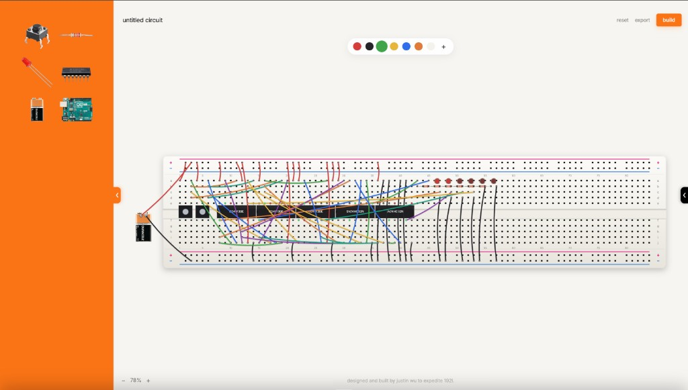

# breadboard



an interactive web breadboard with CircuitJS schematic import/export.

transforms circuit diagrams in falstad to a functioning breadboard design.

a tool to expedite the tedious SYDE 192L experience.

## Run

```bash
bun install && bun run dev
```

Then open [http://localhost:8080](http://localhost:8080). Build with `bun run build`.

## Note

`circuitjs/` directory is Paul Falstad / Iain Sharp’s CircuitJS1 (GPL).
